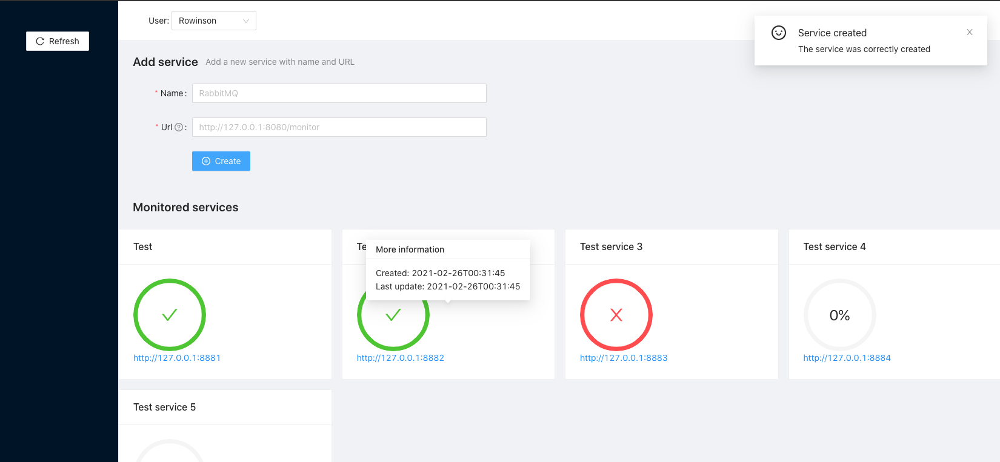
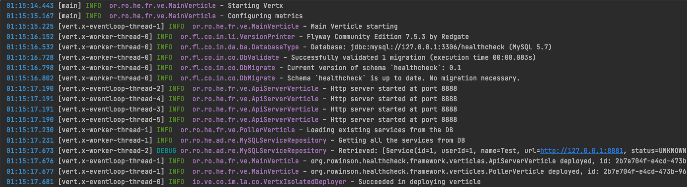

# HealthCheck

[](https://github.com/rwngallego/healthcheck/actions/workflows/tests.yml)

Monitor the status of service endpoints by running periodic pollers.
It uses [Vert.x](https://vertx.io/), a reactive Java toolkit in the
backend and React in the frontend.

## Documentation

For further information:
- [Design and Architecture](docs/design.md)
- The Open API Spec is hosted at: [http://localhost:8888/swagger-v1/](http://localhost:8888/swagger-v1/)

## Usage

Once you run the application, you can go to the `/ui` root:

[http://localhost:8888/ui/](http://localhost:8888/ui/)

From there you can select a user to list the different services.

### Frontend



### Backend



## Run with docker-compose

This is the prefered method to see everything in action. Once run all the
containers, you should be able to access [http://localhost:8888/ui/](http://localhost:8888/ui/)

```bash
docker-compose up -d
```

## Run it locally

You can change the configuration values at `src/main/resources/conf/config.json`:

```json
{
  "WEB_PORT": 8888,
  "DB_PORT": 3306,
  "DB_HOST": "127.0.0.1",
  "DB_DATABASE": "healthcheck",
  "DB_USER": "root",
  "DB_PASSWORD": "healthcheck",
  "DB_POOL_SIZE": 5
}
```

To run it:

```
./gradlew clean run
```

### Tests
```
./gradlew clean test
```

### Package
```
./gradlew clean assemble
```

### Individual container

```bash
docker build -t healthcheck .
docker run healthcheck
```

## Logging

To change the log level `resources/log4j2.xml`:

```xml
    <logger name="org.rowinson.healthcheck" level="info" />
```

