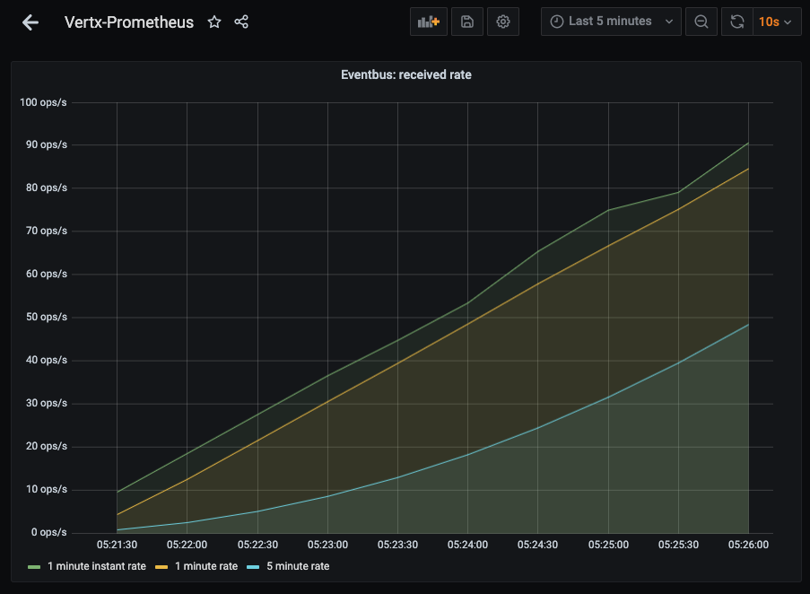

# HealthCheck

[](https://github.com/rwngallego/healthcheck/actions/workflows/tests.yml)

Monitor the status of service endpoints by running periodic pollers.
It uses [Vert.x](https://vertx.io/), a reactive Java toolkit in the
backend and React in the frontend.

## Documentation

For further information:
- [Design and Architecture](docs/design.md)
- The Open API Spec is hosted at: [http://127.0.0.1:8888/swagger-v1/index.html](http://127.0.0.1:8888/swagger-v1/index.html)

## Run with docker-compose

This is the prefered method to see everything in action. However, if the
database container hasn't started yet, the app container will fail and
docker will restart it automatically.

```bash
docker-compose up -d

# to inspect the Java logs:
docker-compose logs -f --tail=10 healthcheck
```

Once all the containers are running, you should be able
to access [http://127.0.0.1:8888/ui/](http://127.0.0.1:8888/ui/)

Have in mind that it will host the already generated package. To make any changes
run it locally.

## Run it locally

You can change the configuration values at `src/main/resources/conf/config.json`:

```json
{
  "WEB_PORT": 8888,
  "DB_PORT": 3306,
  "DB_HOST": "127.0.0.1",
  "DB_DATABASE": "healthcheck",
  "DB_USER": "root",
  "DB_PASSWORD": "healthcheck",
  "DB_POOL_SIZE": 5
}
```

Then you can run it:

```
./gradlew clean run
```

### Unit Tests

You need to configure the values from `src/main/resources/conf/config.test.json`,
or set the configuration values as ENV variables.

```
./gradlew clean test
```

### Package
```
./gradlew clean assemble
```

### Individual container

```bash
docker build -t healthcheck .
docker run healthcheck
```

## Usage

Once you run the application, you can go to the `/ui` root:

[http://127.0.0.1:8888/ui/](http://127.0.0.1:8888/ui/)

From there you can select a user to list the different services.

### Frontend


### Backend


### Metrics

Go to Prometheus: [http://127.0.0.1:9090/](http://127.0.0.1:9090/)

Go to Grafana: [http://127.0.0.1:3000](http://127.0.0.1:3000) (admin/admin and skip), and import the Dashboard from `config/grafana/vertx.json`



## Logging

To change the log level `resources/log4j2.xml`:

```xml
    <logger name="org.rowinson.healthcheck" level="info" />
```

