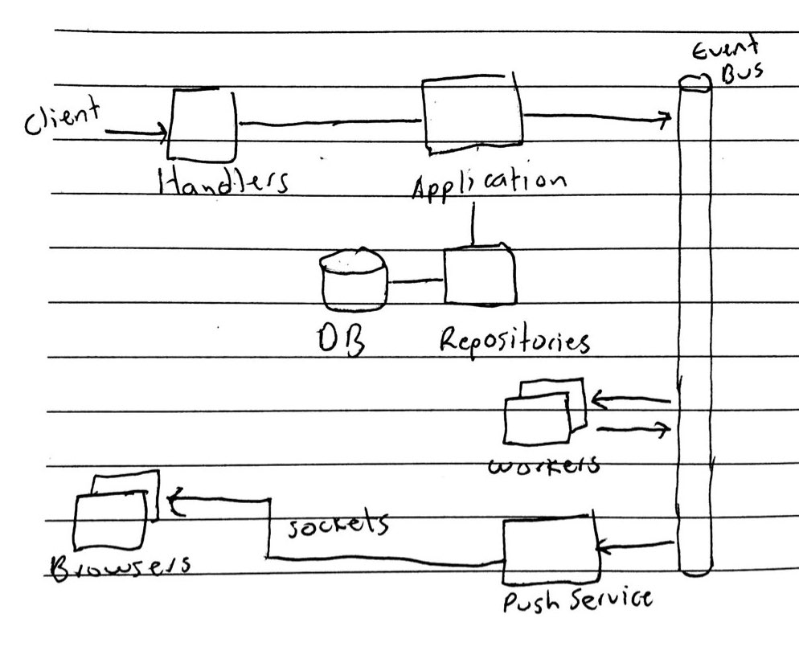

# HealthCheck - Design v1

This app polls periodically the status of the services
that belong to a user. This document outlines the different
considerations, and the architecture design for its initial version.

## Assumptions

The following assumptions were made as part of the design:

- Some parts of the app will be simplified to cover the base use cases but
  can easily be extended (e.g. Sign in/Registration/User CRUD).
- For time constrains, the application will follow a traditional
  approach (stateful objects and a traditional CRUD),
  however given the nature of the problem, it can be
  designed with an Event Driven architecture using the Vertx Event Bus,
  and the CQRS pattern to optimize the reads/writes and improve availability.
  The details of that potential architecture can be found the in
  the [V2 design document](design.v2.md).
- For time constrains, the validation is plain, otherwise it would use https://vertx.io/docs/vertx-web-validation/java/#_using_vert_x_web_validation
## Architecture

The application will have HTTP handlers, the Application logic and the DB
repositories. There will be an event bus, and a set of
components (workers/push service) that will communicate through it.

There will be a pool of workers (Pollers) in charge of performing
periodic health checks to the services. They will receive
events when adding/removing/updating a service and produce events
with the status of the services. Additionally, there could be
a Push Service (Extra) in charge of pushing the real updates to the
clients through [web sockets](https://vertx.io/blog/real-time-bidding-with-websockets-and-vert-x/).
In this case, the event bus plays a crucial
role in the coordination of those components.

### Pollers: Pools, Back pressure and Linear back-off

The workers will use a back-pressure strategy: there will be a pool of
workers, and a queue of jobs to be processed (queue of services to check).
The workers will pick up jobs when they are available to process them.
It's not the application forcing a given worker to do a certain job.

Internally, the workers will use an incremental linear back-off mechanism
to retry the health checks incrementally and protect themselves
from failed endpoints. When a service cannot be pinged after a configurable
Max timeout, it will transition the given service to a FAIL state. This can
be further improved by using exponential backoff: https://docs.aws.amazon.com/general/latest/gr/api-retries.html

For scalability, the workers can be scaled horizontally through a Hazelcast
cluster by sharing their state.

### Scalability

The application relies on the Vertx capabilities to scale using
clustering through [Hazelcast](https://hazelcast.com/blog/vert-x-cluster/).
This means, the shared memory
can be used in the components that are intended to work in a
clustered arrangement. The application can be configured to
support multiple nodes with multiple Verticles deployed.

### Dependency Inversion Principle and testability

To make the code more testable and make the code independent of a given
technology, it's important to follow the DIP principle in the sense that
the inner layers cannot call the outer layers directly but through an interface.
This makes it easier to mock the implementations easily, and thus the
code is more testable.

### Observability: Metrics

Metrics using Micrometer/Prometheus will be implemented, as they are considered
important for observability. An initial implementation will take metrics
of the time spent by the workers, spread across the different service endpoints.

The metrics will be published at: [http://localhost:8888/metrics](http://localhost:8888/metrics),
and can be viewed at: [http://localhost:9090](http://localhost:9090)

## Components

- Event Bus: Glues all the components (Vert.x event bus)
- Handlers: Verticles in charge of processing and transforming the HTTP
  requests and responses.
- Application: Will contain the business rules and integrate with
  an implementation of the repositories.
- Repositories: Abstraction layer for accessing/writing to a given DB.
- DB: In this case MySQL will be used but can be changed.
- Workers: They're in charge of performing HTTP requests to the services
  and produce events with their status. There will be a queue of services
  to check.
- Push Service (Extra): They will receive events from the event bus and communicate
  with the Browsers through a socket connection. In the case of Vertx, that
  communication can be done by using the Event bus.

### Events

- ServiceCreated
- ServiceDeleted
- ServiceStatusFailed
- ServiceStatusSucceeded

## Code structure

The application will have decoupled components that will be separated
according to the Clean Architecture recommendations [[1]](https://blog.cleancoder.com/uncle-bob/2012/08/13/the-clean-architecture.html).
There will be adapters/application/domain/framework layers.

- Adapters: Data transformation between the app and the DB/Web/Others
  - Handlers: Vert.x HTTP Handlers
  - Repositories: DB access
- Application: Contains the business rules and are decoupled from the
  upper layers.
- Domain: Contains the plain entities from the domain that are used throughout
  the application.
- Framework:
  - Vert.x Verticles
  - Vert.x Workers
  - Vert.x Event Bus
  - Configuration
  - Logging
  - Metrics

## Project tasks

- Setup backend/frontend projects
  - [x] CI/CD
  - [x] Logging
  - [x] Metrics
  - [x] Unit Tests
  - [x] Containers (Dockerfile/docker-compose.yml)
  - [x] Code structure
- Backend:
  - [x] Define the API using OpenAPI. Url: [http://localhost:8888/openapi](http://localhost:8888/swagger)
  - [x] Implement the Repositories
  - [x] Implement the Handlers
  - [x] Implement the Application
  - [x] Implement a basic Poller
  - [ ] Implement the Worker pool
  - [ ] Extra: Implement the Push Service
- [x] Frontend:
  - [x] Create the Dashboard page with the list of services and their status
  - [x] Services CRUD:
    - [x] Add
    - [ ] Edit
    - [x] List
    - [ ] Delete
  - [ ] Extra: Push service status updates using web sockets

## Technologies

### Backend

- Vert.x
- MySql
- Asynchronous logging (Log4j 2/Slf4j)
- Clustering through Hazelcast
- Vertx Web sockets to push live service status updates
- Metrics through Micrometer/Prometheus

### Frontend

For the frontend, an SPA will be used with:

- React
- Jest
- Ant Design
- ES6

## API Endpoints

You can find the OpenAPI spec at [http://localhost:8888/swagger-v1/](http://localhost:8888/swagger-v1/)

### Services

The API is segregated by the `user_id` as the root resource to separate
the data from different users. This simulates an API that is consumed
by either the end users or other integration parties. Other mechanisms
that can be implemented are by using a JWT token or a `user_id` header.

Method | Endpoint | Description
--- | --- | ---
GET | /api/v1/users/:userId/services | Get the list of services for the user and their status `"OK"` or `"FAIL"`
POST | /api/v1/users/:userId/services | Create a new service
DELETE | /api/v1/users/:userId/service/:id | Delete service
PUT | /api/v1/users/:userId/service/:id | Update service

### Users (Demo purposes)

Method | Endpoint | Description
--- | --- | ---
POST | /api/v1/users | Create a new user
GET | /api/v1/users | Get the list of users

## Further considerations

- Implement distributed tracing with OpenCensus/Jaeger
