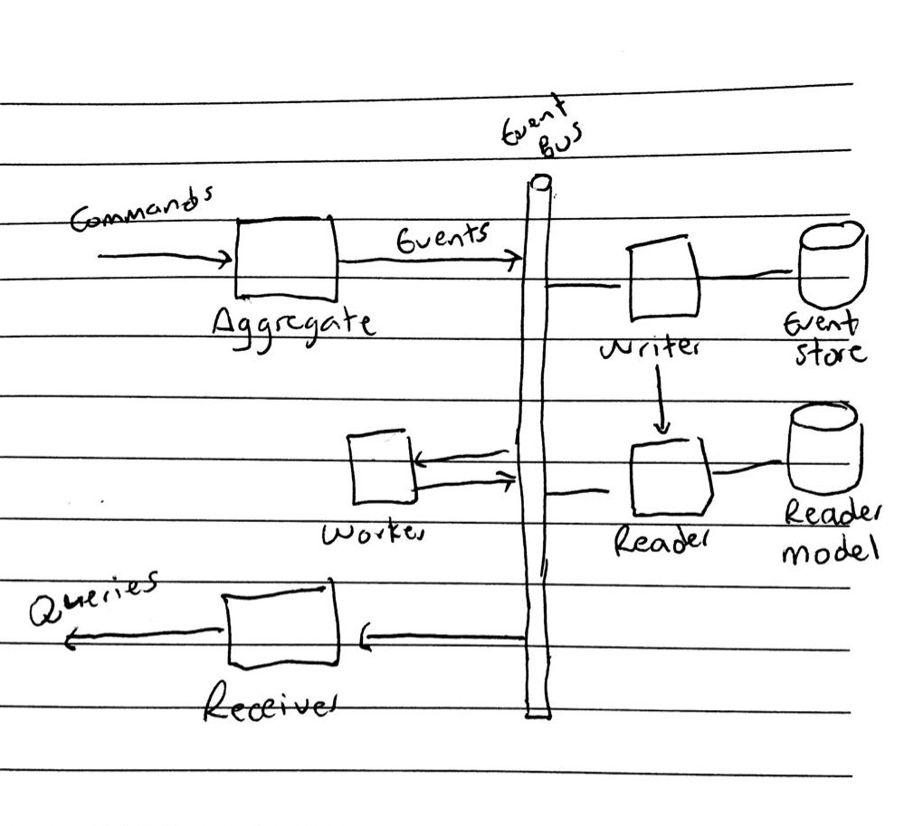

# HealthCheck - Design v2

This app polls periodically the status of the services
that belong to a user. This document outlines the different
considerations, and the architecture design for its initial version.

## Assumptions

The following assumptions were made as part of the design:

- The application needs to be scalable, and it's designed to
  handle high traffic.
- It's important to keep an audit log of the status of the services being
  monitored, and the actions performed over the system.
- Some parts of the app will be simplified to cover the basic use cases but
  can easily be extended.

## Architecture

The application was designed with an Event Driven
architecture in mind, and is for demonstration purposes only. The events are considered
first class citizens, and to improve availability it will follow the CQRS principle (separate and specialized Writer
and Reader). It will rely on eventual consistency in the synchronization.
The events are stored in an Event Store (Writer), and the
projections will be stored as a separate model optimized for reading
(Reader).

For demonstration only, the projection will be recreated
each time the app is restarted, but there are techniques to avoid the
processing overhead (e.g. Using snapshots).

Considerations:

- Events are preferred over stateful objects because of the nature of the problem.
- The Reader can be optimized for queries to achieve low latency.
- The Writer can be optimized for writes to achieve high throughput.
- Eventual consistency between the writer/reader can improve the Availability of the system.
- Audit log of the different actions in the system for free through the Event Store:
  facilitates auditory and invaluable Data Mining.
- Time traveling and easy troubleshooting (time replay).
- Vert.x already provides the artefacts, because it is an event driven toolkit.
- For scalability Vert.x already provides guides on how to implement Hazelcast.

## Components

- Event Bus: Glues all the components (Vert.x event bus)
- Event Store: Stores all the events. All the events are
  immutable and appended to the store. The information is extracted through
  projections in the reader.
- Reader: Contains a model optimized for readings that is synced
  with the Event Store as a projection.
- Aggregates: They accept or reject the commands, produce the events and
  send them to the Event Bus:
  - ServiceAggregate: Aggregate for the services
  - UserAggregate: Aggregate for the users
- Receivers: Reproduce the stored events and get the current
  state.
  - ServiceProjection: Projection for the service
  - UserProjection: Projection for the user

## Events

- ServiceCreated
- ServiceDeleted
- ServiceStatusFailed
- ServiceStatusSucceeded
- ServiceUpdated
- ServiceCreated

## Project tasks

- Setup backend/frontend projects
  - [x] CI/CD
  - [x] Logging
  - [x] Unit Tests
  - [x] Containers (Dockerfile/docker-compose.yml)
  - [x] Code structure
- Backend:
  - [x] Define the API using OpenAPI. Url: [http://localhost:8888/openapi](http://localhost:8888/swagger)
  - [ ] Implement the Writer / Event Store
  - [ ] Implement the Reader / Read model
  - [ ] Implement the HTTP Handlers
  - [ ] Implement the Aggregates:
    - [ ] ServiceAggregate
    - [ ] UserAggregate
  - [ ] Implement the Worker
  - [ ] Implement the receivers:
    - [ ] ServiceProjection
    - [ ] UserProjection
- [ ] Frontend:
  - [ ] Create the Registration/Login page
  - [ ] Create the Dashboard page with the list of services and their status
  - [ ] Services CRUD:
    - [ ] Add
    - [ ] Edit
    - [ ] List/Delete
  - [ ] Extra: Push service status updates using web sockets

## Code structure

It will use [Clean Architecture](https://blog.cleancoder.com/uncle-bob/2012/08/13/the-clean-architecture.html):

- Adapters: Data transformation between the app and the DB/Web/Others
  - Handlers: Vert.x HTTP Handlers
  - Repositories: DB access
  - Workers: Vert.x worker
- Application: Contains the commands, queries, aggregates and projections.
  - Commands: Commands that arrive to the application.
  - Queries: Information requested to the application.
  - Aggregates: Receive the commands and create the events.
  - Projections: Hold the projected events into a temporal state.
- Domain: Contains the plain entities from the domain.
- Framework:
  - Vert.x Event Bus
  - Configuration
  - Logging
  - Metrics

## Technologies

### Backend

Given the Event Driven nature of the architecture, the system will use
Vert.x. It could be also achieved by using
technologies that make it easy (The event loop from Node.JS), or any equivalent (Goroutines/Channels
from Golang, or processes/OTP from Erlang/Elixir).

- Vert.x
- Postgres
- Web sockets to push live service status updates
- Asynchronous logging (Log4j 2/Slf4j)

### Frontend

For the frontend, an SPA will be used with:

- React
- Jest
- Ant Design
- TypeScript

## API Endpoints

You can find the OpenAPI spec at [http://localhost:8888/swagger-v1/](http://localhost:8888/swagger-v1/)

### Services

The following methods require the auth token (JWT)

Method | Endpoint | Description
--- | --- | ---
GET | /api/v1/services | Get the list of services for the user and their status `"OK"` or `"FAIL"`
POST | /api/v1/services | Create a new service
DELETE | /api/v1/service/:id | Delete service
PUT | /api/v1/service/:id | Update service

### Users

Method | Endpoint | Description
--- | --- | ---
POST | /api/v1/users | Create a new user

### Authentication

Method | Endpoint | Description
--- | --- | ---
POST | /api/v1/login | Authenticate the user and get the access token

## Further considerations

- Implement metrics using OpenCensus/Prometheus
- Implement distributed tracing with OpenCensus/Jaeger
